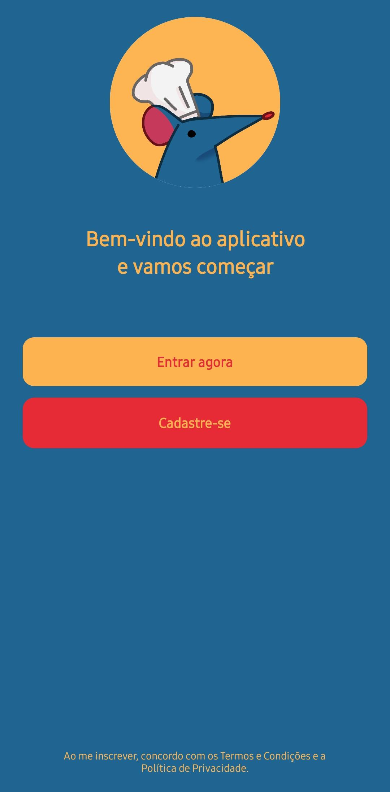
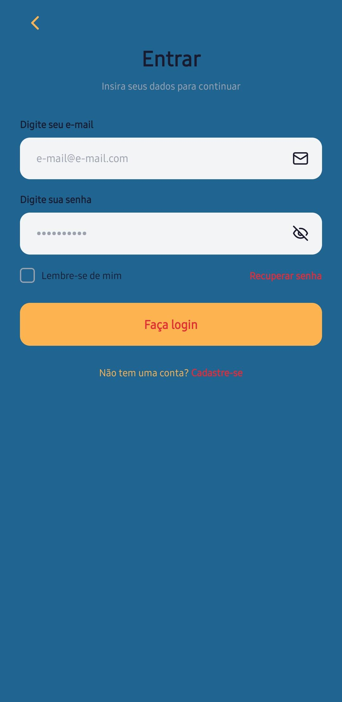
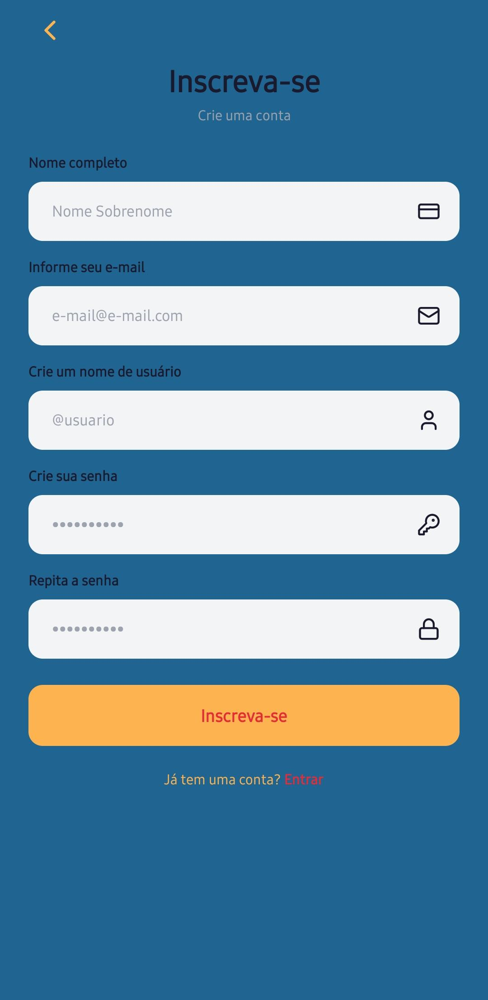
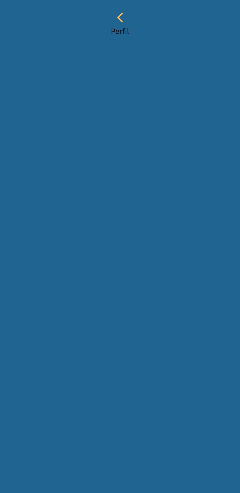
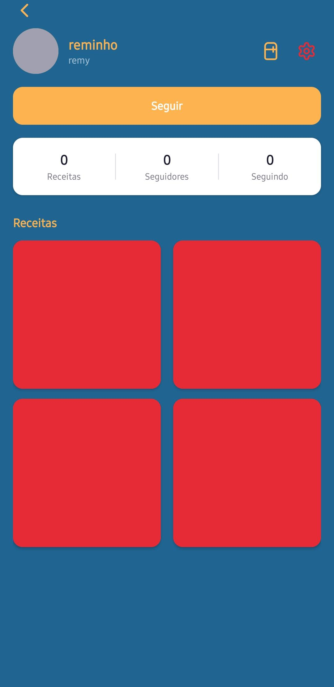
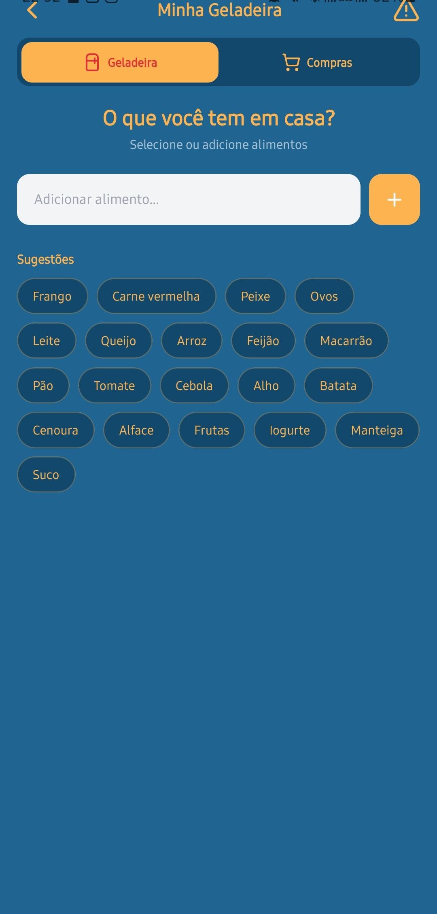
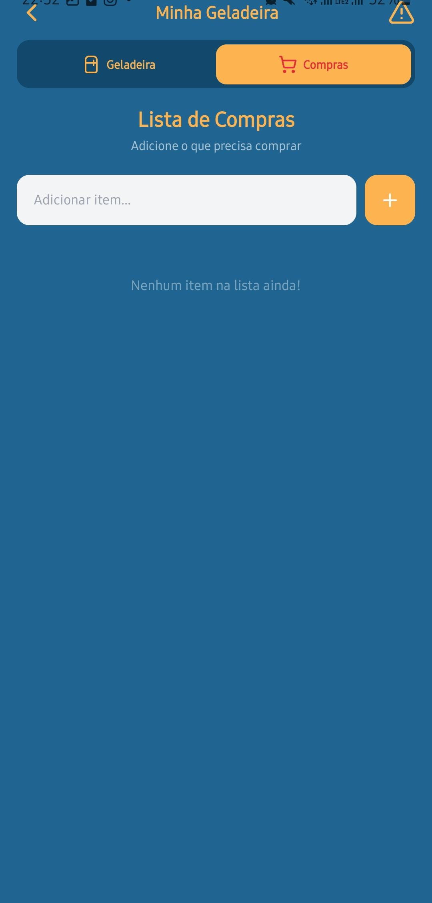
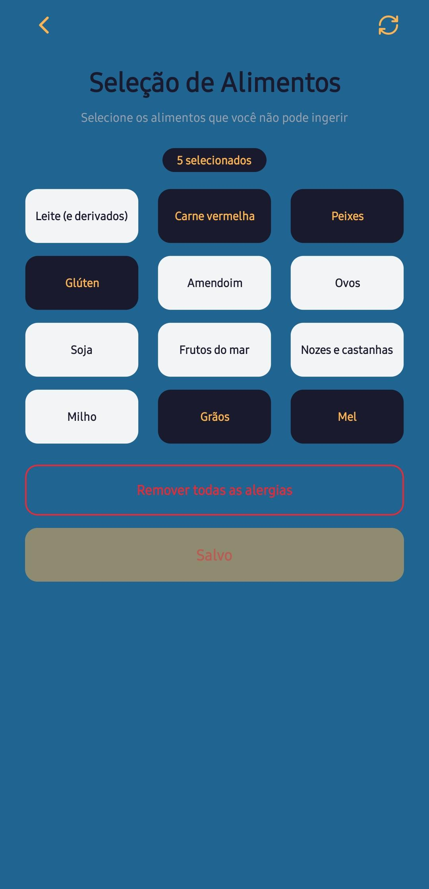
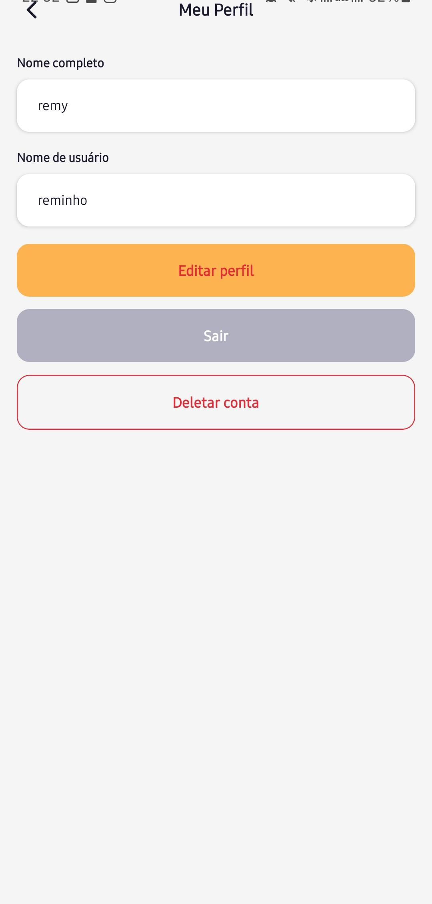

# Projeto de Interface

## User Flow

O User Flow (Fluxo de Usuário) representa a jornada do usuário dentro da aplicação, destacando as principais ações, decisões e caminhos possíveis.

Neste projeto, o fluxo foi desenvolvido para demonstrar a experiência do usuário no SousChef, desde o cadastro e autenticação até o gerenciamento da geladeira, lista de compras e restrições alimentares.

Essa visualização facilita o entendimento do funcionamento da aplicação e contribui para a construção de uma experiência mais intuitiva, eficiente e personalizada.

## Protótipo

Desenvolver um protótipo emerge como uma das maneiras mais ágeis e econômicas de validar uma ideia, conceito ou funcionalidade. Isso permite a interação, avaliação, modificação e aprovação das principais características de uma interface antes de entrar na fase de desenvolvimento.

### Protótipo de baixa fidelidade

Protótipos de baixa fidelidade apresentam de forma simplificada o design da interface e o relacionamento entre suas telas, permitindo a evolução da proposta da solução. Neste projeto, foram utilizados para apoiar a validação dos requisitos e efetuar ajustes com menor impacto no desenvolvimento da aplicação.

| **Tela de Bem-vindo** | **Tela de Login** | **Tela de Cadastro** |
|:---:|:---:|:---:|
|  |  |  |

| **Tela Inicial** | **Tela de Perfil** | **Tela da Geladeira** |
|:---:|:---:|:---:|
|  |  |  |

| **Lista de Compras** | **Tela de Alergias** | **Tela de Configurações** |
|:---:|:---:|:---:|
|  |  |  |

- ## Mapa de Solução
  
O Mapa de Solução apresenta de forma visual a estrutura geral da aplicação SousChef, relacionando os principais módulos e funcionalidades — como autenticação, gerenciamento da geladeira, lista de compras, restrições alimentares e sugestão de receitas.

